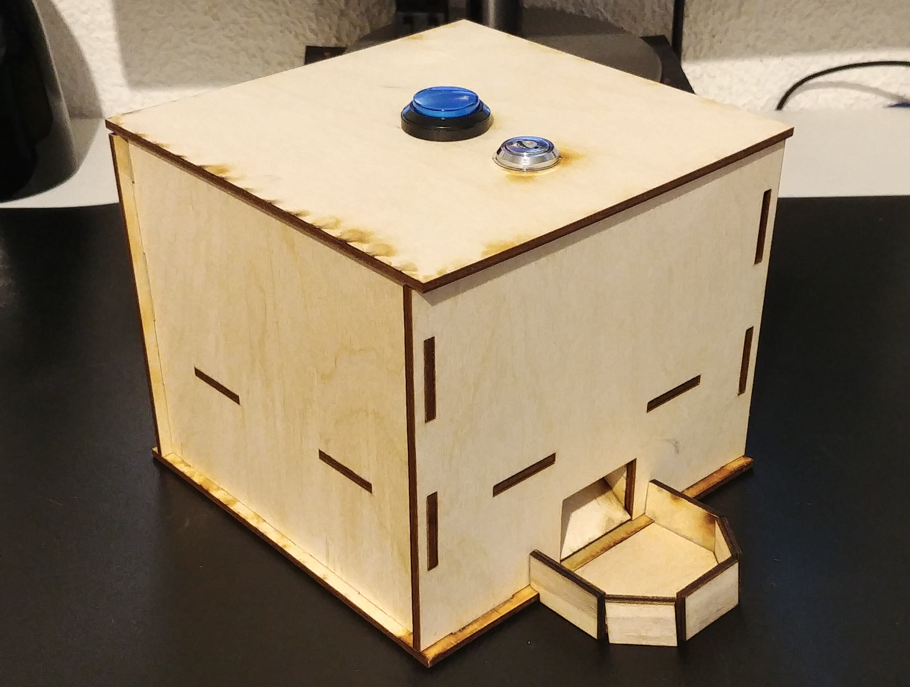
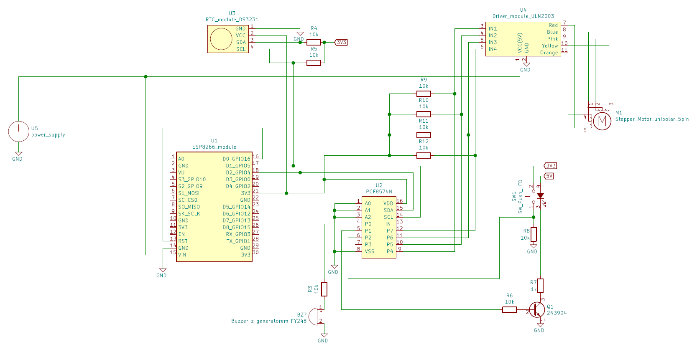
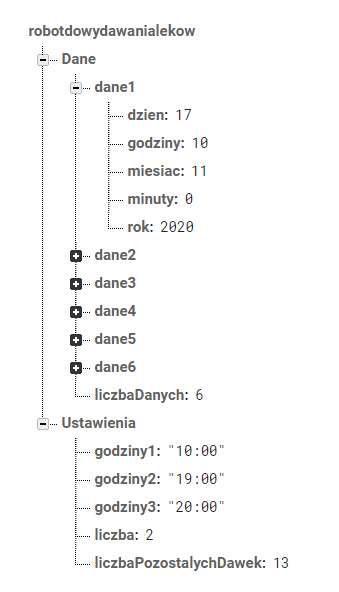

# Project of medications dispending robot
The project consists of mechanical, electronical, and programming parts. The robot is intended for home use and for people that take care of the elderly or the sick.

## Project description
In the mobile application is the possibility to set up hours of alarms and dispensing of medications.

There are sound and light signals when medications are despending. The button on top of the device is used to turn off the alarm.

Information in which the hour alarm was turned off is sent to the database where is the history of hours when the alarm was turned off. A person, who has the mobile application connected with the database, have an access to the history of hours when the alarm was turned off.

An additional assumption is to achieve the highest possible energy saving.

### Mechanical part
The mechanical part includes the outer casing made of plywood and the carousel for medications doses. The carousel is made by the 3D printing technique.

### Electronical part
The main components of electronic circuit are power supply, microcontroller ESP8266, and stepper motor. The microcontroller is programmed in C language.

### Mobile application
The project also includes the creation of a dedicated mobile application. The application is used to read data from the robot and to set up settings for the device. The application was created in Android Studio.

### Real-time database
The intermediary between the application and the device is the real-time database created with Firebase technology.

